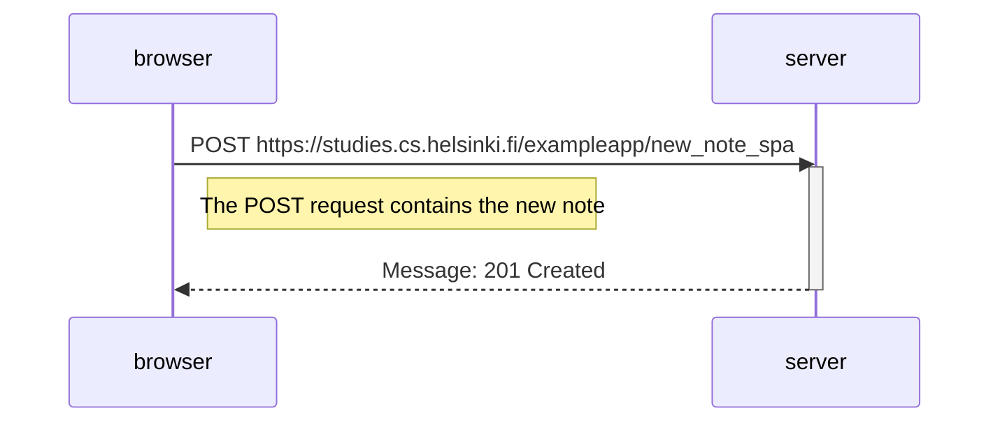

0.6: Uusi muistiinpano

When a user has typed a new note and clicks save the following things happen:

```mermaid
  sequenceDiagram
    participant browser
    participant server
    
    browser->>server: POST https://studies.cs.helsinki.fi/exampleapp/new_note_spa
    activate server

    Note right of browser: The POST request contains the new note
    server-->>browser: Message: 201 Created 
    deactivate server
```

After this, the page does not refresh, but the new note is visible to user in the brower. 
